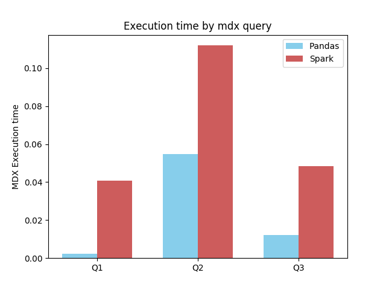
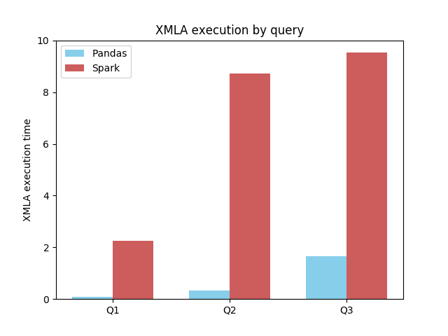

In this benchmark, we will test olapy with two different data analysis tools which are pandas and spark.

we will use the foodmart dataset that contains 7283 rows (see ../olapy-data/cubes/foodmart)

Executing benchmark
-------------------

to test the MDX queries execution we will use 3 different mdx queries

Query 1 ::

      SELECT
      FROM [foodmart]
      WHERE ([Measures].[supply_time])
      CELL PROPERTIES VALUE, FORMAT_STRING, LANGUAGE, BACK_COLOR, FORE_COLOR, FONT_FLAGS

Query 2 ::

      SELECT NON EMPTY Hierarchize(AddCalculatedMembers(DrilldownMember({{{
      [Product].[Product].[All brand_name].Members}}}, {
      [Product].[Product].[brand_name].[Pearl]})))
      DIMENSION PROPERTIES PARENT_UNIQUE_NAME,HIERARCHY_UNIQUE_NAME ON COLUMNS
      FROM [foodmart]
      WHERE ([Measures].[supply_time])
      CELL PROPERTIES VALUE, FORMAT_STRING, LANGUAGE, BACK_COLOR, FORE_COLOR, FONT_FLAGS

Query 3 ::

      SELECT NON EMPTY CrossJoin(Hierarchize(AddCalculatedMembers({
      [Product].[Product].[All brand_name].Members})), Hierarchize(AddCalculatedMembers({
      [Store].[Store].[All store_type].Members})))
      DIMENSION PROPERTIES PARENT_UNIQUE_NAME,HIERARCHY_UNIQUE_NAME ON COLUMNS
      FROM [foodmart]
      WHERE ([Measures].[supply_time])
      CELL PROPERTIES VALUE, FORMAT_STRING, LANGUAGE, BACK_COLOR, FORE_COLOR, FONT_FLAGS

Benchmark MDX Execution result (in seconds)
*******************************************

+----+----------+----------+
|    |  pandas  |  spark   |
+====+==========+==========+
| Q1 | 0.00187  | 0.04100  |
+----+----------+----------+
| Q2 | 0.05702  | 0.21932  |
+----+----------+----------+
| Q3 | 0.01302  | 0.10562  |
+----+----------+----------+

Benchmark XMLA Execution result (in seconds)
********************************************

+----+----------+----------+
|    |  pandas  |  spark   |
+====+==========+==========+
| Q1 | 0.10528  | 2.51553  |
+----+----------+----------+
| Q2 | 0.44219  | 5.67158  |
+----+----------+----------+
| Q3 | 2.07166  | 8.03670  |
+----+----------+----------+

Running Benchmarks by yourself
------------------------------

To run benchmarks

from olapy_pandas_VS_olapy_pyspark directory

1) pip install -r requirements.txt

2) python benchmark.py